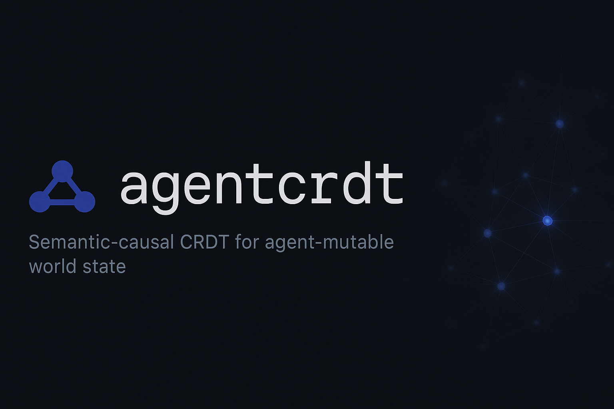
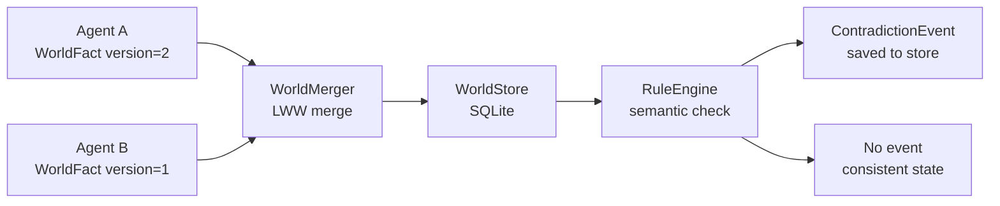

# agentcrdt

**Semantic-causal CRDT for agent-mutable world state.**



[](https://github.com/sandeep-alluru/agentcrdt/actions/workflows/ci.yml)
[](https://pypi.org/project/agentcrdt/)
[](https://pypi.org/project/agentcrdt/)
[](https://pypi.org/project/agentcrdt/)
[](LICENSE)
[](https://codecov.io/gh/sandeep-alluru/agentcrdt)
[](https://mypy-lang.org/)

[Quick Start](#quick-start) · [How It Works](#how-it-works) · [CLI Reference](#cli-reference) · [MCP / Claude](#mcp--claude-desktop-integration) · [OpenAI](#openai-integration) · [vs. Alternatives](#vs-alternatives) · [Contributing](CONTRIBUTING.md)

---

## Why

Multi-agent systems share a mutable view of the world. When two agents update the same fact simultaneously — or when one agent asserts a fact that logically contradicts another — the shared state becomes inconsistent.

Traditional approaches either:
- **Lock everything** — too slow for real-time agents
- **Last-write wins blindly** — loses causal context and semantic validity
- **Ignore contradictions** — downstream agents act on stale or conflicting beliefs

**agentcrdt** solves this with a semantic-causal CRDT:

- Every fact is content-addressed by `(domain, entity, attribute)` — same key always resolves to the same slot
- Concurrent updates merge via **Last-Write-Wins** (version then timestamp)
- Semantic rules detect **logical contradictions** across domains (e.g. a dead king can't have a valid treaty)
- Contradiction events are persisted as first-class objects for audit and remediation

```bash
agentcrdt set life king alive False --agent-id agent-A
agentcrdt merge agent-B.db
agentcrdt events   # shows ContradictionEvents if rules are violated
```

---

## How It Works



**Core primitives:**

- **WorldFact** — content-addressed by `SHA-256[:16]("domain|entity|attribute")`. Same key across agents = same slot. Value and version are mutable metadata.
- **SemanticRule** — a first-order implication: "if `domain.entity.attr=X` then `other_domain.entity.other_attr` must be `Y`".
- **RuleEngine** — evaluates rules against the merged world state. Returns `ContradictionEvent` objects for violations.
- **WorldMerger** — merges two stores via LWW, then runs the rule engine.
- **WorldStore** — SQLite-backed fact and event store. Thread-unsafe; one store per process.

---

## Features

| Feature | Details |
|---------|---------|
| Content-addressed facts | Same `(domain, entity, attribute)` always produces the same ID |
| LWW CRDT merge | Higher version wins; on tie, higher timestamp wins |
| Semantic rules | `SemanticRule` + `RuleEngine` detect cross-domain contradictions |
| Contradiction events | Persisted as `ContradictionEvent` objects in the store |
| Offline / local-first | Single SQLite file, no server required |
| JSON output | Machine-readable output for downstream automation |
| Markdown output | Ready-to-paste GitHub PR comment |
| FastAPI REST server | `/fact`, `/facts`, `/merge`, `/events`, `/health` endpoints |
| MCP server | Model Context Protocol integration for Claude and other agents |
| 52 tests | Comprehensive test suite covering all layers |

---

## Quick Start

```bash
pip install agentcrdt
```

```python
from agentcrdt import WorldFact, WorldStore, WorldMerger, SemanticRule, RuleEngine

# Agent A: king is dead
fact_a = WorldFact(domain="life", entity="king", attribute="alive",
                   value=False, version=1, agent_id="agent-A")

# Agent B: treaty is still valid (inconsistent!)
fact_b = WorldFact(domain="alliance", entity="king", attribute="valid",
                   value=True, version=1, agent_id="agent-B")

rule = SemanticRule(
    name="dead-king-voids-treaty",
    trigger_domain="life", trigger_attribute="alive", trigger_value=False,
    implies_domain="alliance", implies_entity_same=True,
    implies_attribute="valid", implies_value=False,
)

with WorldStore("local.db") as local, WorldStore("remote.db") as remote:
    local.set_fact(fact_a)
    remote.set_fact(fact_b)
    result = WorldMerger(rule_engine=RuleEngine([rule])).merge(local, remote)
    print(result.conflicts)  # [ContradictionEvent(rule='dead-king-voids-treaty', ...)]
```

---

## CLI Reference

```bash
agentcrdt [--db PATH] COMMAND [ARGS]
```

| Command | Description |
|---------|-------------|
| `set DOMAIN ENTITY ATTR VALUE` | Store or update a world fact |
| `get DOMAIN ENTITY ATTR` | Retrieve a world fact by key |
| `merge OTHER_DB` | Merge another store into this one (LWW CRDT) |
| `events` | List all contradiction events |
| `status` | Show fact count and event count |
| `--version` | Show installed version |

**Examples:**

```bash
agentcrdt --db world.db set life king alive False --version 2 --agent-id agent-A
agentcrdt --db world.db get life king alive
agentcrdt --db world.db merge /tmp/agent-b.db
agentcrdt --db world.db events
agentcrdt --db world.db status
```

---

## MCP / Claude Desktop Integration

Add to `~/.config/claude/claude_desktop_config.json`:

```json
{
  "mcpServers": {
    "agentcrdt": {
      "command": "agentcrdt-mcp"
    }
  }
}
```

Available MCP tools: `set_world_fact`, `get_world_facts`, `merge_world_state`.

---

## OpenAI Integration

agentcrdt exposes OpenAI-compatible tool definitions in `tools/openai-tools.json`:

```python
import json
tools = json.loads(open("tools/openai-tools.json").read())
# Pass `tools` to openai.chat.completions.create(tools=tools, ...)
```

Topics: `#crdt` `#agents` `#multi-agent` `#world-state` `#llmops` `#mcp`

---

## Python API

```
src/agentcrdt/
├── fact.py       # WorldFact, ContradictionEvent
├── rules.py      # SemanticRule, RuleEngine
├── store.py      # WorldStore (SQLite)
├── merger.py     # WorldMerger, MergeResult
├── report.py     # print_state, print_events, to_json, to_markdown
├── cli.py        # Click CLI entry point
├── api.py        # FastAPI REST server
└── mcp_server.py # MCP server
```

---

## vs. Alternatives

| Tool | Approach | Semantic Rules | MCP |
|------|----------|---------------|-----|
| **agentcrdt** | Content-addressed LWW CRDT | Yes | Yes |
| Automerge | JSON CRDT | No | No |
| Yjs | CRDT text/map | No | No |
| Redis | Key-value store | No | No |
| custom DB | Ad-hoc | Manual | No |

---

## Star History

[](https://star-history.com/#sandeep-alluru/agentcrdt&Date)

---

## Smithery

agentcrdt is available on [Smithery](https://smithery.ai) — search for `agentcrdt`.

---

## Case Studies

See how teams are using agentcrdt in production:

- [Conflict-Free World State for 500k Concurrent MMO Players](docs/case-studies/gaming-mmo-world-state.md) — Cascade Games eliminates boss-fight HP flickering and enables 500k concurrent players
- [Conflict-Free Shared Knowledge Base for a 6-Agent Research Pipeline](docs/case-studies/enterprise-multi-agent-research.md) — Cognition Labs reduces report synthesis from 3 hours to 12 minutes

## Contributing

See [CONTRIBUTING.md](CONTRIBUTING.md). PRs reviewed within 5 business days.
